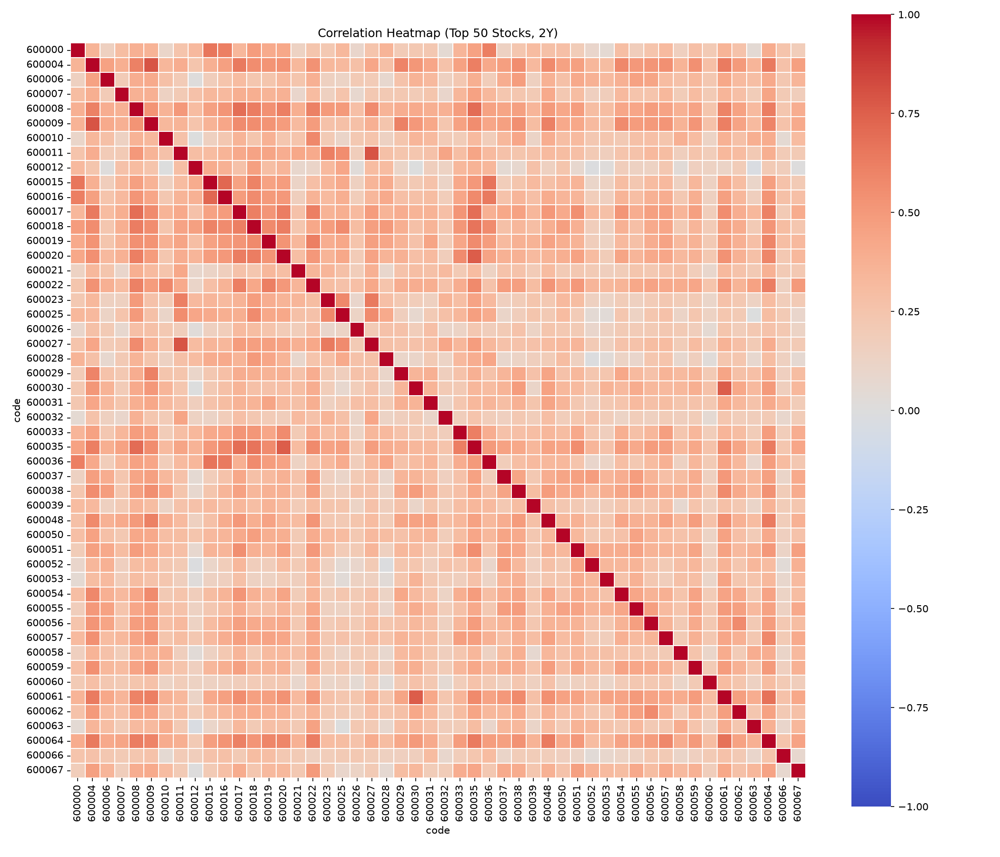
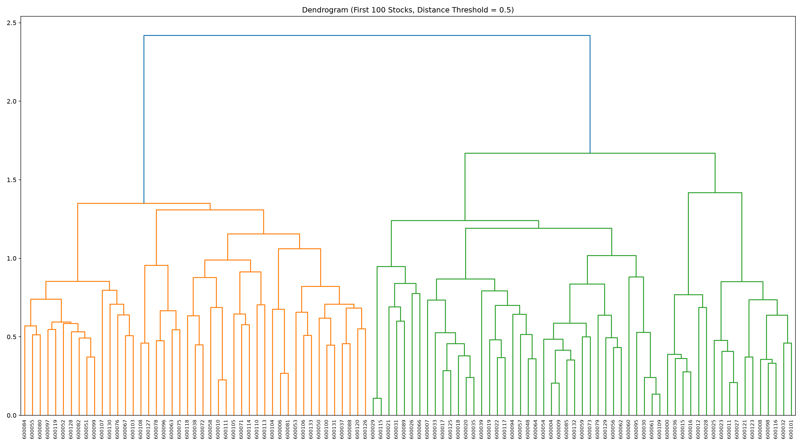
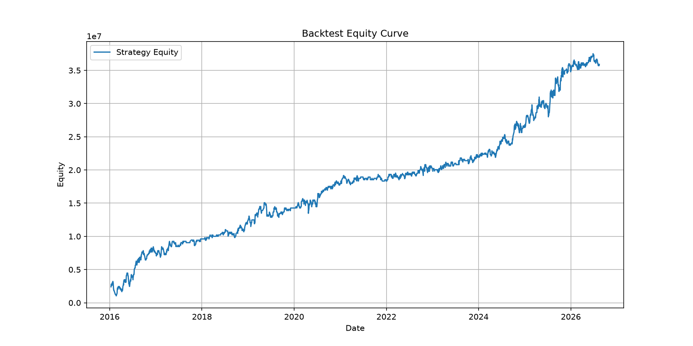

# SSE-StatArb-Pipeline

A complete statistical arbitrage pipeline for the **Shanghai Stock Exchange (SSE)**: data engineering, correlation analysis, clustering, and pairs trading backtest.

> **Disclaimer**: This project is for educational and research purposes only. It does not constitute investment advice.

---

## 📌 Project Overview

Statistical arbitrage assumes that related stocks tend to move together in the long run.  
This project implements a pairs trading strategy on the Shanghai Stock Exchange:

1. Build a historical daily dataset using Yahoo Finance.
2. Compute pairwise correlations.
3. Cluster stocks using Ward’s method.
4. Select cointegrated pairs within clusters.
5. Backtest a mean-reversion strategy with rolling re-estimation.

---

## 📁 Repository Structure

```
.
├── Stock_codes.py            # Step 1: Fetch current SSE stock codes, generate sse_codes.csv
├── Initial_data_fetch.py     # Step 2: Download full historical data from Yahoo Finance into MongoDB
├── update.py                 # Step 3: Incrementally update MongoDB with new data
├── api.py                    # Step 4: REST API built with FastAPI
├── Analysis_A.py             # Correlation matrix and top correlated pairs
├── Analysis_B.py             # Hierarchical clustering (Ward's method)
├── Backtest.py               # Pairs trading backtest
├── requirements.txt          # Python dependencies
├── LICENSE
├── README.md
├── .gitignore
│
├── sse_codes.csv             # (Generated) Current SSE stock code list
├── stock_clusters.csv        # (Generated) Cluster assignment for each stock
├── correlation_matrix.csv    # (Generated) Pairwise correlation matrix
├── top_correlated_pairs.csv  # (Generated) Top 50 correlated pairs
├── equity_curve.csv          # (Generated) Daily equity during backtest
├── trade_log.csv             # (Generated) Record of all simulated trades
│
├── correlation_heatmap_top50.png   # (Generated) Heatmap of top 50 stock correlations
├── dendrogram.png                  # (Generated) Hierarchical clustering dendrogram
└── equity_curve.png                # (Generated) Backtest equity curve
```
> **Note**: Generated data files (`.csv`, `.png`) are included in `.gitignore` by default.  
> If you want to showcase the charts, you can force add them or remove the corresponding ignore rules.

---

## 🚀 Getting Started

### 1. Prerequisites

- Python 3.10+
- MongoDB running locally at `mongodb://127.0.0.1:27017`
- Docker Desktop (used to run MongoDB Atlas local container)

### 2. Install dependencies

```bash
pip install -r requirements.txt
```

### 3. Start MongoDB using MongoDB Atlas CLI

The project uses a local MongoDB Atlas deployment managed by the Atlas CLI.

- **Deployment name**: `myDeployment`
- **Container image**: `quay.io/mongodb/mongodb-atlas-local:8.0`

Start the deployment with:

```bash
atlas local start myDeployment
```

Alternatively, you can use Docker Desktop directly to start the container:

```bash
docker start myDeployment
```

Once running, MongoDB will be accessible at `127.0.0.1:27017`.

To check the status of your local deployments, run:

```bash
atlas local list
```

To stop the deployment when not in use:

```bash
atlas local stop myDeployment
```

---

## 📡 Data Acquisition & Maintenance

### Step 1: Fetch the latest SSE stock code list

```bash
python Stock_codes.py
```

This script scrapes the currently listed SSE stock codes from [stockanalysis.com](https://stockanalysis.com/list/shanghai-stock-exchange/) and saves them to `sse_codes.csv`.  
**Always run this step first** because the subsequent scripts depend on this CSV.

The current list contains **2353 stocks**, including A-shares, B-shares, and STAR Market (科创板) stocks.

### Step 2: Download initial historical data

```bash
python Initial_data_fetch.py
```

Reads `sse_codes.csv`, downloads daily historical data (adjusted close, open, high, low, volume) from **Yahoo Finance** for each stock from **2010-01-01** to the present, and stores it in MongoDB.

### Step 3: Incremental updates

```bash
python update.py
```

Checks the latest date for each stock in MongoDB and fetches only the new data after that date. Run this regularly to keep the database up to date.

### Step 4: Start the REST API

```bash
python api.py
```

This starts a FastAPI server at `http://127.0.0.1:8000`.  
Interactive docs: `http://127.0.0.1:8000/docs`.

---

## 🔌 API Usage

### Stored Fields

| Field | Type | Description |
|-------|------|-------------|
| `date` | datetime | Trading day (UTC) |
| `metadata.code` | string | Stock code, e.g., `600000` |
| `open` | float | Adjusted open price |
| `high` | float | Adjusted high price |
| `low` | float | Adjusted low price |
| `close` | float | Adjusted close price |
| `adj_close` | float | Yahoo Finance adjusted close |
| `volume` | int | Trading volume |

### Endpoint

```
GET /api/stock_data
```

### Query Parameters

<table>
  <thead>
    <tr>
      <th>Parameter</th>
      <th>Type</th>
      <th>Required</th>
      <th>Description</th>
    </tr>
  </thead>
  <tbody>
    <tr>
      <td><code>ticker</code></td>
      <td>string</td>
      <td>Yes</td>
      <td>Stock code, e.g., <code>600000</code></td>
    </tr>
    <tr>
      <td><code>start</code></td>
      <td>date</td>
      <td>Yes</td>
      <td>Start date in <code>YYYY-MM-DD</code> format</td>
    </tr>
    <tr>
      <td><code>end</code></td>
      <td>date</td>
      <td>Yes</td>
      <td>End date in <code>YYYY-MM-DD</code> format</td>
    </tr>
    <tr>
      <td><code>fields</code></td>
      <td>string</td>
      <td>No</td>
      <td>Comma-separated list of fields. Default: <code>open,high,low,close,volume,adj_close</code></td>
    </tr>
  </tbody>
</table>

### Example Request

```bash
curl "http://127.0.0.1:8000/api/stock_data?ticker=600000&start=2020-01-01&end=2020-12-31&fields=high,low,volume"
```
Or just type and enter the URL in your surfer.

### Example Response

```json
[
  {
    "date": "2020-01-02",
    "high": 11.2,
    "low": 10.8,
    "volume": 1234567
  },
  {
    "date": "2020-01-03",
    "high": 11.5,
    "low": 11.0,
    "volume": 2345678
  }
]
```

### Error Handling

- If no data is found, the API returns HTTP `404` with:
  ```json
  { "detail": "No data found for the given criteria" }
  ```

---

## 📊 Data Analysis

### 1. Correlation Model – `Analysis_A.py`

Computes pairwise **Pearson correlations** of daily log returns over the most recent **2 years**.  
Outputs:

- `correlation_matrix.csv`
- `top_correlated_pairs.csv`
- `correlation_heatmap_top50.png`

Run:

```bash
python Analysis_A.py
```

### 2. Clustering – `Analysis_B.py`

Converts correlations to distances (`distance = 1 - correlation`) and applies **hierarchical clustering** using **Ward’s method**.  
Outputs:

- `stock_clusters.csv`
- `dendrogram.png`

Run:

```bash
python Analysis_B.py
```
---

## 📈 Backtest
### Rules

Runs a rolling-window pairs trading strategy:

- Re-estimate pairs and hedge ratios every **20 trading days** using the previous **250 days**.
- Select pairs within the same cluster with correlation > **0.8**.
- Keep only cointegrated pairs (Engle-Granger test, p < 0.05).
- Enter when spread z-score exceeds **±2**.
- Exit when z-score reverts to **±0.5**, or after **20 days**, or on stop-loss at **±3.5**.

Run:

```bash
python Backtest.py
```

Results are printed to the terminal and saved to `equity_curve.csv`, `equity_curve.png`, and `trade_log.csv`.

### Spread and Z-Score

$$ \text{spread}_t = \ln(P_{A,t}) - \beta \ln(P_{B,t}) - \alpha $$

$$ z_t = \frac{\text{spread}_t - \mu_t}{\sigma_t} $$

### Results

| Metric | Value |
|--------|-------|
| Total return | 1397.31% |
| Annualized return | 29.13% |
| Sharpe ratio | 0.88 |
| Max drawdown | -67.52% |
| Win rate | 51.86% |
| Number of trades | 1182 |

> ⚠️ **Caveats**:  
> The maximum drawdown of **-67.52%** is very high, indicating significant tail risk.  
> These results are based on historical data and do not account for all real-world frictions.  
> They should **not** be interpreted as a guarantee of future performance.

---

## 🖼️ Visualizations

- Correlation heatmap (top 50 stocks)  
  

- Hierarchical clustering dendrogram  
  

- Backtest equity curve  
  

---

## 🛠️ Technologies Used

- Python 3
- MongoDB
- Docker
- MongoDB Atlas CLI
- FastAPI / Uvicorn
- pandas / NumPy
- SciPy / scikit-learn
- statsmodels
- matplotlib / seaborn
- Yahoo Finance
- BeautifulSoup / lxml

---

## ⚠️ Limitations

- **Survivorship bias**: only currently listed stocks are included; delisted stocks are missing.
- **Data source**: Yahoo Finance may have incomplete or delayed data.
- **Transaction costs**: approximated; real-world costs may be higher.
- **Parameter sensitivity**: thresholds and rebalancing intervals were chosen as reasonable defaults, not fully optimized.
- **Look-ahead bias**: rolling windows reduce but do not completely eliminate this bias.

---

## 🔮 Future Improvements

- Optimise the strategy to reduce volatility and drawdown.
- Explore additional filters for pair selection (e.g., fundamental data).
- Implement more robust stop-loss / position-sizing methods.
- Add unit tests and CI/CD for data update scripts.

---

## 📄 License

This project is licensed under the **MIT License**.  
See the `LICENSE` file for details.

---

## 📬 Contact

For any questions or collaboration opportunities, please:
- Open an issue in this repository
- Contact me at `qmaiaa@connect.ust.hk`
---